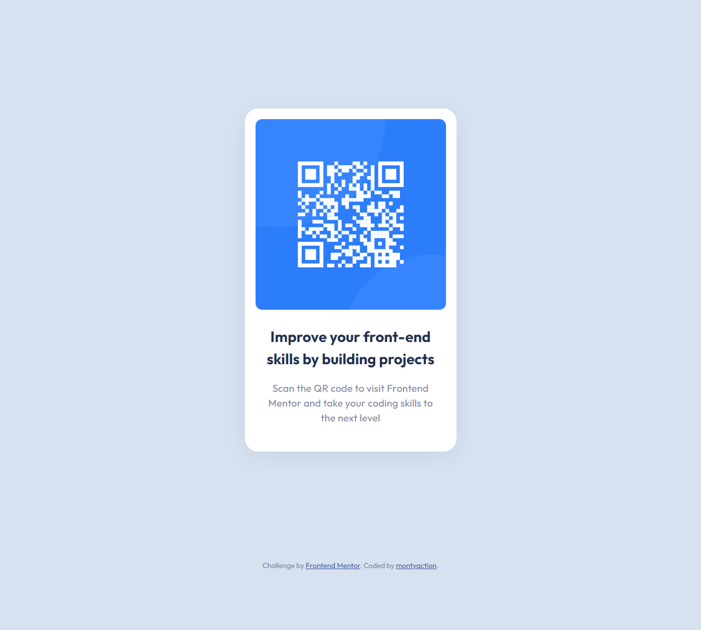

# Frontend Mentor - QR code component solution

This is a solution to the [QR code component challenge on Frontend Mentor](https://www.frontendmentor.io/challenges/qr-code-component-iux_sIO_H). Frontend Mentor challenges help you improve your coding skills by building realistic projects. 

## Table of contents

- [Overview](#overview)
  - [The challenge](#the-challenge)
  - [Screenshot](#screenshot)
  - [Links](#links)
- [My process](#my-process)
  - [Built with](#built-with)
  <!-- - [What I learned](#what-i-learned) -->
  - [Continued development](#continued-development)
  - [Useful resources](#useful-resources)
- [Author](#author)

## Overview

### The challenge

Users should be able to:

- View the optimal layout depending on their device's screen size
- See hover states for interactive elements

### Screenshot

### Links

- Solution URL: [Add solution URL here](https://github.com/montyaction/single-price-grid-component)
- Live Site URL: [Add live site URL here](https://animated-naiad-6c084a.netlify.app/)

## My process

### Built with

- HTML
- SCSS
- Responsive

### Continued development
For future projects I need to focus on using more advanced CSS to create effects.

### Useful resources

- [W3 School](https://www.w3schools.com/default.asp) - This helped me for my basic knowledge. I really liked this pattern and will use it going forward.
- [How To Create an Overlay Image Icon](https://www.w3schools.com/howto/howto_css_image_overlay_icon.asp) - This helped me to add an overlay to the image on hover.
- [Using only CSS, show div on hover over another element](https://stackoverflow.com/questions/5210033/using-only-css-show-div-on-hover-over-another-element) - This Stack Overflow question helped me to figure out how to show the view icon on hover.

## Author

- Portfolio - [montyaction](https://blissful-banach-06fb18.netlify.app/
)
- Frontend Mentor - [@montyaction](https://www.frontendmentor.io/profile/montyaction)
- Twitter - [@MontyKanwar19](https://twitter.com/MontyKanwar19)
- Instagram - [frontend_action](https://www.instagram.com/frontend_action/)